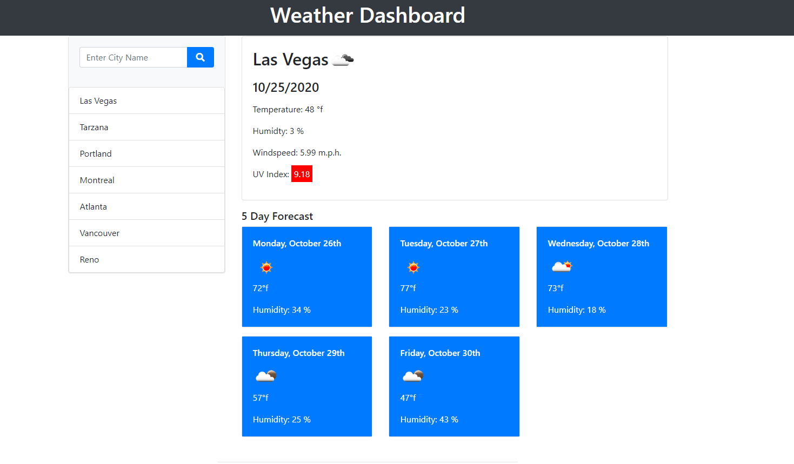

# Weather Dashboard

## Purpose
This is a weather app implementing the Open Weather Map API using the Fetch method.  Since the API key is supposed to be secret and not shared, I created a secret js file and linked it to my project and placed the secret file name in to my gitignore file.

The app opens with Las Vegas weather loaded, but will fill in whatever city you choose from your search.  The fields include today's weather plus a forecast of the next five days.

A daily uv index will display in a field colored to reflect the uv level of low, moderate or high.

Your search history will be saved in Local Storage and displayed on the left under the search field.  The list is updated with your most recent search at the top and will hold up to seven cities.  Any duplicate searches will not be displayed.  When you refresh your screen your list will reload.

The weather icons are provided by the Open Weather Map API.  

The web design is responsive and breakpoints have been set in Bootstrap to be viewable on smaller devices.

The design is 100% created by scratch using Bootstrap and some CSS.

# Built With
- HTML
- Bootstrap
- CSS
- JavaScript
- Open Weather Map API
  

# Website

[Github Pages](https://webprinc3ss.github.io/weather-dashboard/index.html)
 

# Media

 

# Credit
Coded by webprinc3ss (me).

