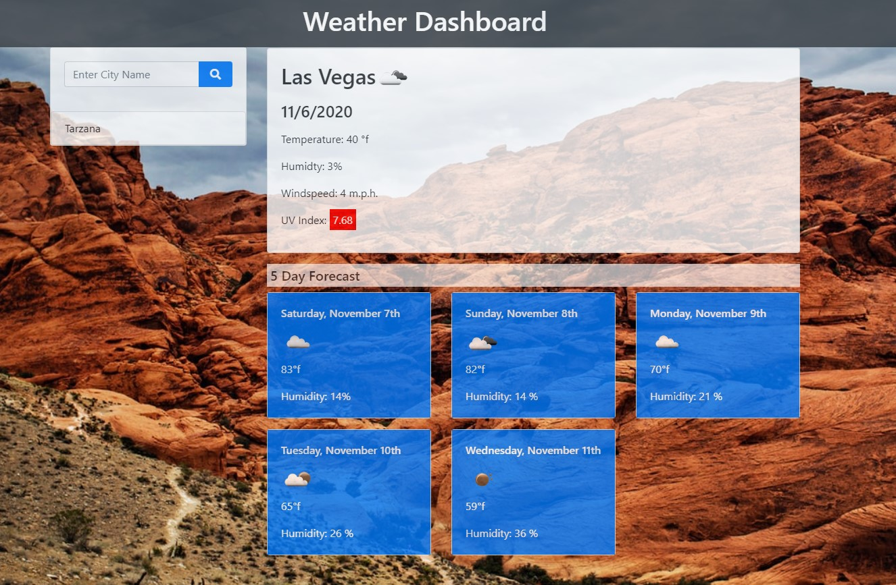

# Weather Dashboard

## Purpose
This is a weather app implementing the free Open Weather Map API using the Fetch method.  

The app opens with Las Vegas weather loaded, but will fill in whatever city you choose from your search.  The fields include today's weather plus a forecast of the next five days.

A daily uv index will display in a field colored to reflect the uv level of low, moderate or high.

Your search history will be saved in Local Storage and displayed on the left under the search field.  The list is updated with your most recent search at the top and will hold up to seven cities.  Any duplicate searches will not be displayed.  When you refresh your screen your list will reload.

The weather icons are provided by the Open Weather Map API.  

I used a free API key provided by Open Weather Map.

Since this is a school project and the key is free, I have uploaded this in a functional state with the API key for grading purposes.

Use your own API key if you do this yourself and consider hiding your API key if you do not want others using it or are using a paid API.

Create a secret.js file and linked it to you project and place that name in your gitignore file.  I used the following syntax in my secret.js: var apiKey = "put your key # here ".

# Built With
- HTML
- Bootstrap
- CSS
- JavaScript
- Open Weather Map API

[Open Weather Map](https://openweathermap.org/api)

The web design is responsive and breakpoints have been set in Bootstrap to be viewable on smaller devices.

The design is 100% created by scratch using Bootstrap and some CSS.
  

# Website

[Github Pages](https://webprinc3ss.github.io/weather-dashboard/index.html)
(You really need to download this code and run it locally to view the working site.)
 

# Media

 

# Credit
Coded by webprinc3ss (me).

